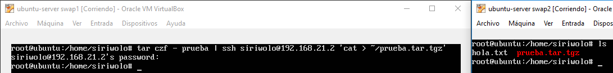
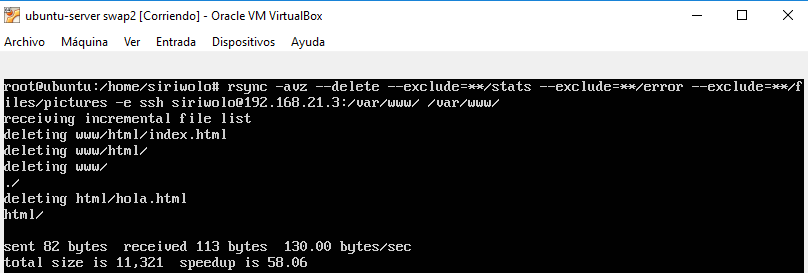
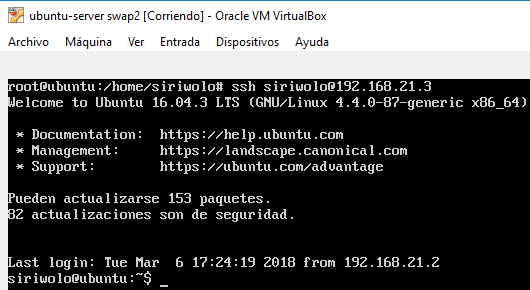
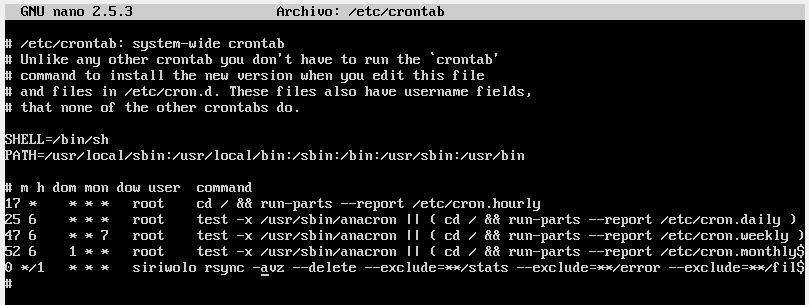

# practica 2

### IP's
swap1: 192.168.21.2

swap2: 192.168.21.3

### capturas
copiar contenido de una maquina a otra por ssh  

clonado de carpeta con rsync  

conexión por ssh sin contraseña  

configuracion del crontab para clonar la carpeta cada hora  

