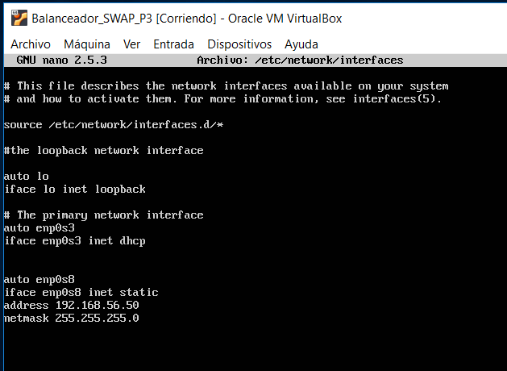
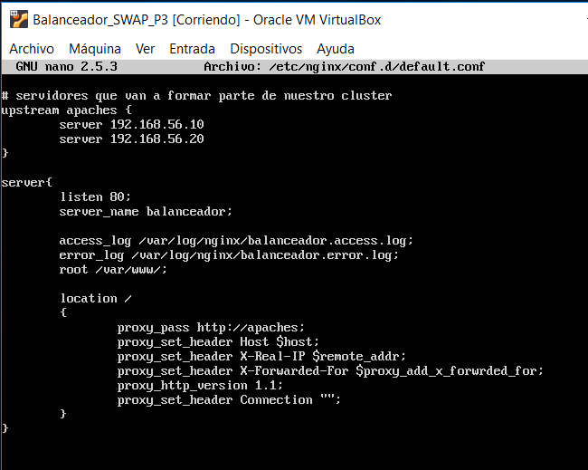
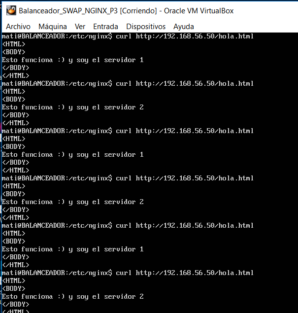
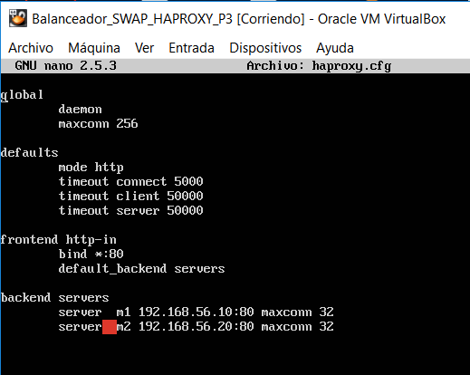
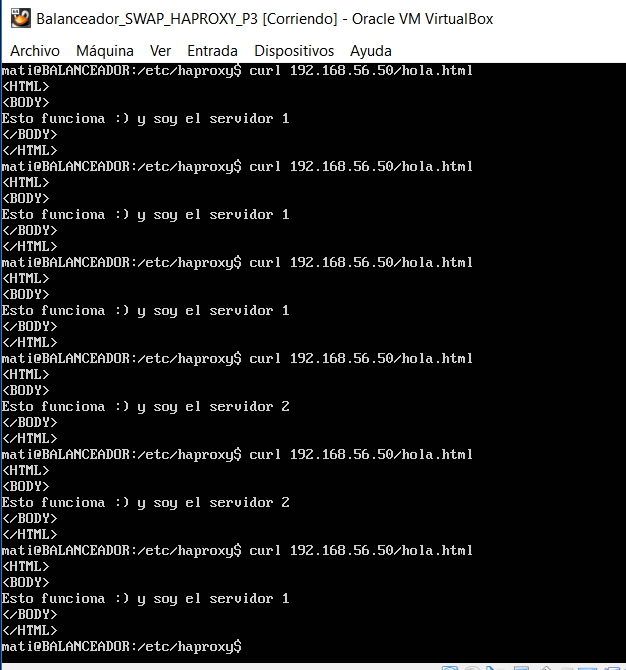
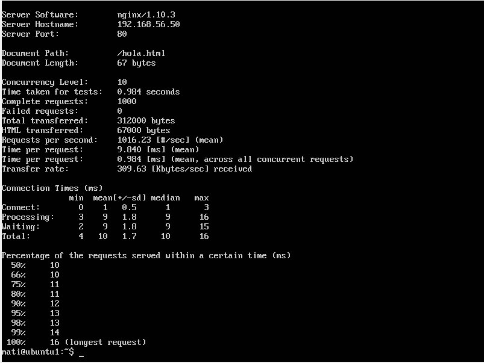
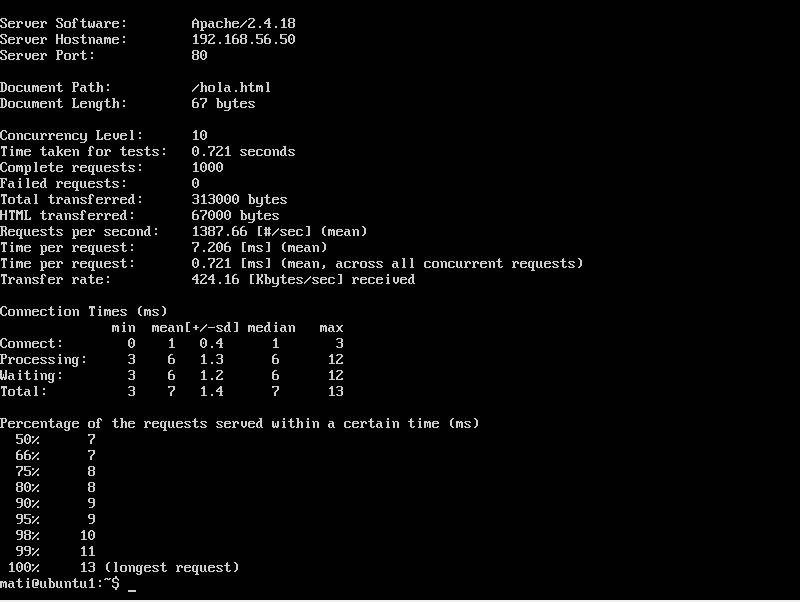
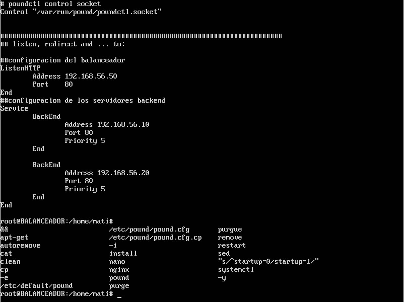

## Practica 3

### **Balanceo de carga**
Hay que llevar a cabo las siguientes tareas:

***1. configurar una máquina e instalar el nginx como balanceador de carga***

***2. configurar una máquina e instalar el haproxy como balanceador de carga***

***3. someter a la granja web a una alta carga, generada con la herramienta Apache
Benchmark, teniendo primero nginx y después haproxy.***

Al comenzar hemos elegido la opción de clonar una de las máquinas y borrar el paquete lamp con las ordenes “sudo apt-get remove lamp-server^ && sudo apt-get purge lamp-server^ && sudo apt-get clean lamp-server^”, al avanzar en la práctica no nos deja actualizar ni instalar, hemos optado por desechar la máquina y instalamos una nueva maquina desde cero, le ponemos la ip:192.168.56.50

La configuramos y la actualizamos con la orden “sudo apt-get update && sudo apt-get dist-upgrade && sudo apt-get autoremove”, la clonamos para instalar un balanceador en cada máquina nueva, de esta forma solo tendremos que apagar una y encender otra para probar ambos.

### **1. configurar una máquina e instalar el nginx como balanceador de carga**

Instalamos nginx con la orden “sudo apt-get instll nginx”, como indica en la practica la configuramos en “/etc/nginx/conf.d/default.conf” y lo lanzamos con “sudo systemctl start nginx”

Configuración default.conf:

Llegando a este punto el balanceador no nos funciona, y es que tenemos que entrar en la configuración, con “sudo nano nginx.conf” y comentar # include /etc/nginx/sites-enabled/*; línea que nos dice que es un servidor, así funciona solo como balanceador. Probamos nuestro servidor, hacemos las peticiones con la orden curl, observamos que hace un balanceo round-robin.

### **2. configurar una máquina e instalar el haproxy como balanceador de carga**

Instalamos haproxy con la orden “sudo apt-get install haproxy”, la configuración esta en “/etc/haproxy/haproxy.sfg”, vamos a  configurar un balanceo con ponderación donde la máquina 1 tiene el doble de capacidad que la máquina 2. 

Editamos el fichero de configuración haproxy.cfg, la configuración no es la que se indica en la practica, en la cual nos daba un error, la versión no soporta actualizaciones, asi que hemos buscado una que nos sirve :

Para salvar la configuración en el fichero, lanzamos el servicio “sudo /usr/sbin/haproxy -f /etc/haproxy/haproxy.cfg”, no nos ha salido ningún error, así que, probamos el servidor con la orden curl.

### **3. someter a la granja web a una alta carga, generada con la herramienta Apache Benchmark, teniendo primero nginx y después haproxy.**

Para esta parte de la practica hemos rescatado una maquina virtual con una ip diferente al resto, de esta forma, el balanceador no tiene otras ocupaciones, y el tiempo que muestra es solo el reparto de la carga a los servidores. Lanzamos con la orden benchmark “ab -n 1000 -c 10 192.168.56.50/hola.html” , se solicita 1000 veces la página hola.html a la dirección 192.168.56.50 (ip de nuestro balanceador), las peticiones se hacen concurrentemente de 10 en 10.

Resultados para nginx:

Resultados para haproxy:

Por los resultados obtenidos, determinamos que funciona mejor el balanceador haproxy.

### **Adicionalmente, y como tarea opcional para conseguir una mayor nota en esta práctica, se propone el uso de algún otro software de balanceo diferente a los dos explicados en este guion (por ejemplo Pound).**
	
Hemos instalado y configurado el balanceador de carga Pound, para ello, hemos instalado un nuevo ubuntu_server y hemos ejecutado "apt-get -y install pound", después hemos modificado el archivo de configuración "/etc/pound/pound.cfg"

Ejecutamos  "sed -i -e "s/^startup=0/startup=1/" /etc/default/pound" para que todos los ficheros pound, que empiecen por startup=0 lo cambio por startup=1, esto es para que cuando encendamos el pc, el servicio se ponga en marcha. Después lo reiniciamos con "systemctl restart pound" para hacer efectivos los cambios.

Resultados para pound:

Seguimos manteniendo nuestra misma opinión, el mejor balanceador es haproxy, su time taken for tests es el menor, los anteriores son muy similares, mientras que el pound cuando le pones muchas peticiones tarda mucho en procesar los datos.
	
Practica realizada por José María Aguilera Barea y María Matilde Cabrera González.

